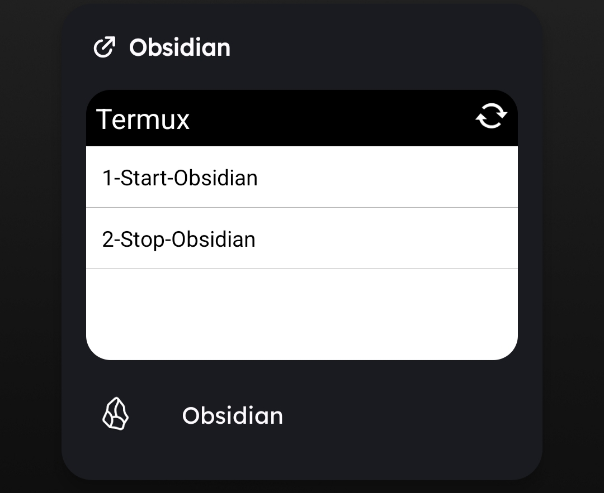

# Termux Obsidian Sync

A set of shell scripts to automate the Git synchronization workflow for an Obsidian vault on Android, enabling a seamless cross-device experience.



## The Problem

Using Obsidian across multiple devices (like a desktop and an Android phone) requires a reliable synchronization method. While Git is a powerful solution, the manual process of pulling, committing, and pushing changes within a mobile environment like Termux is tedious and error-prone. This friction discourages frequent syncing, leading to outdated notes and merge conflicts.

## The Solution

This project provides a simple, robust automation layer over Git to manage an Obsidian vault within Termux. It consists of two core scripts, located in the `src/` directory:

*   `start-sync.sh`: Executed **before** opening Obsidian. It fetches the latest changes from the remote repository to ensure the vault is up-to-date.
*   `stop-sync.sh`: Executed **after** closing Obsidian. It automatically commits all local changes with a timestamped message and pushes them to the remote repository.

These scripts are designed to be triggered by the **Termux:Widget** plugin, allowing for one-tap synchronization directly from the Android home screen.

## Technical Challenges & Key Learnings

This project served as a deep dive into the practical challenges of mobile automation and system integration. Key accomplishments include:

*   **Advanced Git Workflow Implementation:**
    *   **Problem:** The local and remote Git histories diverged, causing sync failures.
    *   **Action:** I resolved the conflict by executing a targeted `git reset --hard origin/master` to re-establish the remote as the single source of truth.
    *   **Result:** This restored repository integrity and provided a crucial lesson in managing destructive Git commands safely.

*   **Android OS & Process Management Diagnosis:**
    *   **Problem:** The Termux widget was unreliable, executing scripts intermittently.
    *   **Action:** I diagnosed the root cause as Android's aggressive battery optimization, which was prematurely terminating background processes.
    *   **Result:** By reconfiguring the app's battery settings to "Unrestricted," I achieved 100% execution reliability, demonstrating an ability to debug issues beyond the code layer and into the host operating system.

*   **Linux/Shell Environment Mastery:**
    *   **Problem:** Scripts failed to execute due to `command not found` errors and permission issues.
    *   **Action:** I reinforced the environment by setting correct file permissions (`chmod 700`) and ensuring proper script invocation by understanding the role of the system's `$PATH` variable.
    *   **Result:** A robust and secure execution environment for all automation scripts.

## How to Use

1.  Clone this repository into your Termux environment: `git clone [URL_DO_SEU_REPO]`
2.  Navigate into the project directory: `cd termux-obsidian-sync`
3.  Edit the `VAULT_PATH` variable inside `src/start-sync.sh` and `src/stop-sync.sh` to point to the correct path of your Obsidian vault.
4.  (Recommended) To use with the Termux:Widget, create a `.shortcuts` directory in your home folder (`mkdir -p ~/.shortcuts`) and create symbolic links to the scripts:
    ```bash
    ln -s ~/termux-obsidian-sync/src/start-sync.sh ~/.shortcuts/1-Start-Sync
    ln -s ~/termux-obsidian-sync/src/stop-sync.sh ~/.shortcuts/2-Stop-Sync
    ```
5.  Ensure Termux and its plugins have "Unrestricted" battery usage permissions in your Android settings for reliable widget performance.

